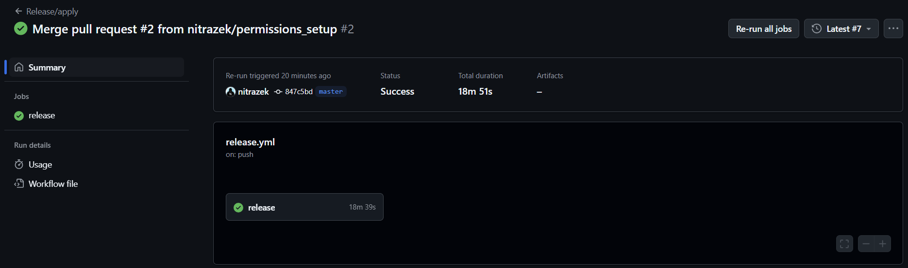
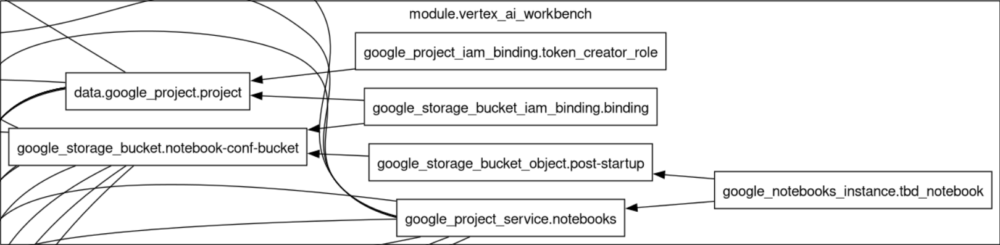

IMPORTANT ❗ ❗ ❗ Please remember to destroy all the resources after each work session. You can recreate infrastructure by creating new PR and merging it to master.
  


1. Authors:

   ***enter your group nr***

   ***link to forked repo***
   
2. Follow all steps in README.md.

3. In boostrap/variables.tf add your emails to variable "budget_channels".

4. From avaialble Github Actions select and run destroy on main branch.
   
5. Create new git branch and:
    1. Modify tasks-phase1.md file.
    
    2. Create PR from this branch to **YOUR** master and merge it to make new release. 
    
    


6. Analyze terraform code. Play with terraform plan, terraform graph to investigate different modules.

    Terraform module named "vertex-ai-workbench" provisions a Google Cloud Notebook environment with the following key components:

    Project & Local Variables:
    Retrieves project details using the provided project ID and sets local variables (e.g., zone and default Compute Engine service account).

    Service Enabling:
    Activates the Notebooks API required for Notebook instance creation.

    Storage Bucket:
    Creates a secure Storage Bucket for configuration files with enforced public access prevention, uniform bucket-level access, and versioning enabled.

    Post-Startup Script:
    Uploads a post-startup shell script to the bucket, which is used to initialize the Notebook instance.

    Notebook Instance:
    Provisions a Notebook instance using a container image, with custom machine type and network settings (no public IP for enhanced security).

    IAM Bindings:
    Assigns necessary IAM roles to the Compute Engine service account, including the token creator role for secure operations.

    This module is used to deploy a reproducible and secure Notebook environment on Google Cloud.

    Output from command "terraform graph | grep 'module\.vertex_ai_workbench'"
    ```bash
    subgraph "cluster_module.vertex_ai_workbench" {
    label = "module.vertex_ai_workbench"
    "module.vertex_ai_workbench.data.google_project.project" [label="data.google_project.project"];
    "module.vertex_ai_workbench.google_notebooks_instance.tbd_notebook" [label="google_notebooks_instance.tbd_notebook"];
    "module.vertex_ai_workbench.google_project_iam_binding.token_creator_role" [label="google_project_iam_binding.token_creator_role"];
    "module.vertex_ai_workbench.google_project_service.notebooks" [label="google_project_service.notebooks"];
    "module.vertex_ai_workbench.google_storage_bucket.notebook-conf-bucket" [label="google_storage_bucket.notebook-conf-bucket"];
    "module.vertex_ai_workbench.google_storage_bucket_iam_binding.binding" [label="google_storage_bucket_iam_binding.binding"];
    "module.vertex_ai_workbench.google_storage_bucket_object.post-startup" [label="google_storage_bucket_object.post-startup"];
    "module.vertex_ai_workbench.data.google_project.project" -> "module.jupyter_docker_image.docker_registry_image.jupyterlab";
    "module.vertex_ai_workbench.data.google_project.project" -> "module.vpc.google_compute_firewall.default-internal-allow-all";
    "module.vertex_ai_workbench.data.google_project.project" -> "module.vpc.google_compute_firewall.fw-allow-ingress-from-iap";
    "module.vertex_ai_workbench.data.google_project.project" -> "module.vpc.module.cloud-router.google_compute_router_nat.nats";
    "module.vertex_ai_workbench.data.google_project.project" -> "module.vpc.module.vpc.module.firewall_rules.google_compute_firewall.rules";
    "module.vertex_ai_workbench.data.google_project.project" -> "module.vpc.module.vpc.module.firewall_rules.google_compute_firewall.rules_ingress_egress";
    "module.vertex_ai_workbench.data.google_project.project" -> "module.vpc.module.vpc.module.routes.google_compute_route.route";
    "module.vertex_ai_workbench.data.google_project.project" -> "module.vpc.module.vpc.module.vpc.google_compute_shared_vpc_host_project.shared_vpc_host";
    "module.vertex_ai_workbench.google_notebooks_instance.tbd_notebook" -> "module.vertex_ai_workbench.google_project_service.notebooks";
    "module.vertex_ai_workbench.google_notebooks_instance.tbd_notebook" -> "module.vertex_ai_workbench.google_storage_bucket_object.post-startup";
    "module.vertex_ai_workbench.google_project_iam_binding.token_creator_role" -> "module.vertex_ai_workbench.data.google_project.project";
    "module.vertex_ai_workbench.google_project_service.notebooks" -> "module.jupyter_docker_image.docker_registry_image.jupyterlab";
    "module.vertex_ai_workbench.google_project_service.notebooks" -> "module.vpc.google_compute_firewall.default-internal-allow-all";
    "module.vertex_ai_workbench.google_project_service.notebooks" -> "module.vpc.google_compute_firewall.fw-allow-ingress-from-iap";
    "module.vertex_ai_workbench.google_project_service.notebooks" -> "module.vpc.module.cloud-router.google_compute_router_nat.nats";
    "module.vertex_ai_workbench.google_project_service.notebooks" -> "module.vpc.module.vpc.module.firewall_rules.google_compute_firewall.rules";
    "module.vertex_ai_workbench.google_project_service.notebooks" -> "module.vpc.module.vpc.module.firewall_rules.google_compute_firewall.rules_ingress_egress";
    "module.vertex_ai_workbench.google_project_service.notebooks" -> "module.vpc.module.vpc.module.routes.google_compute_route.route";
    "module.vertex_ai_workbench.google_project_service.notebooks" -> "module.vpc.module.vpc.module.vpc.google_compute_shared_vpc_host_project.shared_vpc_host";
    "module.vertex_ai_workbench.google_storage_bucket.notebook-conf-bucket" -> "module.jupyter_docker_image.docker_registry_image.jupyterlab";
    "module.vertex_ai_workbench.google_storage_bucket.notebook-conf-bucket" -> "module.vpc.google_compute_firewall.default-internal-allow-all";
    "module.vertex_ai_workbench.google_storage_bucket.notebook-conf-bucket" -> "module.vpc.google_compute_firewall.fw-allow-ingress-from-iap";
    "module.vertex_ai_workbench.google_storage_bucket.notebook-conf-bucket" -> "module.vpc.module.cloud-router.google_compute_router_nat.nats";
    "module.vertex_ai_workbench.google_storage_bucket.notebook-conf-bucket" -> "module.vpc.module.vpc.module.firewall_rules.google_compute_firewall.rules";
    "module.vertex_ai_workbench.google_storage_bucket.notebook-conf-bucket" -> "module.vpc.module.vpc.module.firewall_rules.google_compute_firewall.rules_ingress_egress";
    "module.vertex_ai_workbench.google_storage_bucket.notebook-conf-bucket" -> "module.vpc.module.vpc.module.routes.google_compute_route.route";
    "module.vertex_ai_workbench.google_storage_bucket.notebook-conf-bucket" -> "module.vpc.module.vpc.module.vpc.google_compute_shared_vpc_host_project.shared_vpc_host";
    "module.vertex_ai_workbench.google_storage_bucket_iam_binding.binding" -> "module.vertex_ai_workbench.data.google_project.project";
    "module.vertex_ai_workbench.google_storage_bucket_iam_binding.binding" -> "module.vertex_ai_workbench.google_storage_bucket.notebook-conf-bucket";
    "module.vertex_ai_workbench.google_storage_bucket_object.post-startup" -> "module.vertex_ai_workbench.google_storage_bucket.notebook-conf-bucket";
    ```

    Fragment of the generated photo using command "terraform graph | dot -Tpng >> terraform_graph.png":
    

7. Reach YARN UI
   
   ***place the command you used for setting up the tunnel, the port and the screenshot of YARN UI here***
   
8. Draw an architecture diagram (e.g. in draw.io) that includes:
    1. VPC topology with service assignment to subnets
    2. Description of the components of service accounts
    3. List of buckets for disposal
    4. Description of network communication (ports, why it is necessary to specify the host for the driver) of Apache Spark running from Vertex AI Workbech
  
    ***place your diagram here***

9. Create a new PR and add costs by entering the expected consumption into Infracost
For all the resources of type: `google_artifact_registry`, `google_storage_bucket`, `google_service_networking_connection`
create a sample usage profiles and add it to the Infracost task in CI/CD pipeline. Usage file [example](https://github.com/infracost/infracost/blob/master/infracost-usage-example.yml) 

   ***place the expected consumption you entered here***

   ***place the screenshot from infracost output here***

10. Create a BigQuery dataset and an external table using SQL
    
    ***place the code and output here***
   
    ***why does ORC not require a table schema?***

11. Find and correct the error in spark-job.py

    ***describe the cause and how to find the error***

12. Add support for preemptible/spot instances in a Dataproc cluster

    ***place the link to the modified file and inserted terraform code***
    
    
